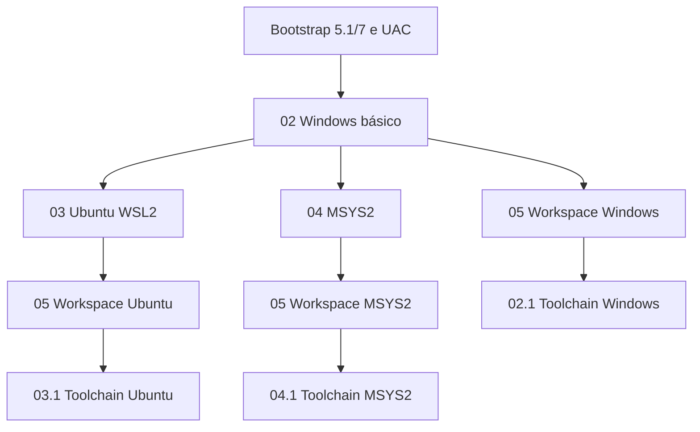

# 01 — Índice geral e arquitetura

> Documento migrado do Notion e reorganizado. **Revise caminhos, versões e efeitos antes de aplicar.** A instalação deve ser testada em máquina de laboratório e reexecutada para validar idempotência.


## Princípios definitivos
- Windows 11 é o host de IDEs gráficas (VS Code e IntelliJ) e de Docker Desktop.
- **Três estruturas nativas e independentes**: Windows `C:\workspace` em NTFS; Ubuntu `/workspace` em ext4; MSYS2 UCRT64 `/workspace` no NTFS da instalação MSYS2 (raiz física `C:\msys64\workspace`, quando MSYS2 instalado em `C:\msys64`). O MSYS2 não dispõe de filesystem Linux separado.
- Em **cada** estrutura, `local/bin`, `local/env` e `local/config` são próprios do ambiente. Eliminar a convenção antiga `/opt/local/bin`.
- O PATH inclui **uma única entrada** para `local/bin` de cada ambiente: `C:\workspace\local\bin` (PowerShell 5.1 e 7), `/workspace/local/bin` (Ubuntu), `/workspace/local/bin` (MSYS2). Os diretórios com o mesmo nome **não são compartilhados**.
- `dev/{cache,build,config,tools}` contém artefatos e ferramentas de desenvolvimento; `local/config` é a configuração e personalização dos shells (completion, profiles, prompt), e `local/env` contém variáveis do ambiente.
- Os arquivos pessoais em `C:\workspace\shared` continuam sendo a única origem compartilhada quando montados no WSL e acessados pelo MSYS2 em `/c/workspace/shared`. Não transformar `local/env` do WSL em bind mount do Windows.
- Containers Linux usam Docker Desktop com WSL2 backend; Windows containers são um modo alternativo e exclusivo. Não instalar uma segunda engine no Ubuntu.
## Mapa de pastas
```text
Windows C:\workspace\ (NTFS)
  projects/windows/   projects/posix/
  dev/{cache,build,config,tools}/
  local/{bin,env,config,docker}/
  shared/{documents,downloads,pictures,music,videos}/

Ubuntu /workspace/ (ext4)
  projects/{linux,infra/containers}/
  dev/{cache,build,config,tools}/
  local/{bin,env,config,docker/{config,data,logs,staging}}/
  shared/ [somente conteúdo pessoal: bind mounts NTFS]

MSYS2 UCRT64 /workspace/ (NTFS, raiz física C:\msys64\workspace)
  projects/posix/
  dev/{cache,build,config,tools}/
  local/{bin,env,config}/
  shared/ [acesso opcional direto em /c/workspace/shared, sem duplicação]
```
Em instalações MSYS2 fora de `C:\msys64`, ajuste o diretório físico do `/workspace`. O prefixo `/ucrt64` e os pacotes do `pacman` permanecem gerenciados pelo MSYS2; somente a personalização segue `/workspace/local`.
## Personalização dos shells
- PowerShell 5.1/7: perfis mínimos carregam `C:\workspace\local\config\powershell\init.ps1`, com módulos comuns e específicos de edição.
- Ubuntu Bash: `~/.bashrc` importa `/workspace/local/config/bash/init.bash` do ext4.
- MSYS2 Bash: `~/.bashrc` importa `/workspace/local/config/bash/init.bash` próprio do MSYS2.
- Completion, aliases e Oh My Posh são opcionais, separados por shell; caches em `dev/cache`. Inicialização não realiza builds nem downloads silenciosos.
- Variáveis `JAVA_HOME`, `MAVEN_HOME`, `GRADLE_HOME` são nativas de cada SO. Windows usa WinGet para Temurin e ZIP oficial para Maven/Gradle; Ubuntu usa SDKMAN; UCRT64 usa toolchain do pacman.
## Mapa de dependências alvo

A numeração organiza a leitura; ambientes opcionais não bloqueiam os demais. O catálogo atual ainda possui tarefas agregadas: a decomposição é trabalho do marco M4.



Docker Desktop/integração são subetapas com requisitos próprios em 02/03. Shells (06) dependem do workspace correspondente; completions dependem das ferramentas selecionadas. IDEs e integrações (06.1), validação (07) e backup (08) seguem seus escopos.

- [Plano de execução completo: marcos, dependências e aceite](plano-de-execucao.md)
- [Bootstrap e arquitetura do executor](arquitetura-executor.md)

## Segurança e integridade
- Não substituir caminhos, mounts, PATH ou dados preexistentes sem inventário e backup.
- O PATH deve ser idempotente: preservar entradas existentes e evitar duplicação por diferenças de barras e caixa.
- Não utilizar `source`/`eval` irrestritos para interpretar arquivos `env` externos; limitar variáveis permitidas e tratar segredos separadamente, criptografados.
- Configs específicas do shell não são compartilhadas por symlink entre Windows, Ubuntu e MSYS2.
- Não sincronizar repositórios de código corporativo, venv, caches, bases e volumes Docker ativos com Drive.
## Aceite
- [ ] Três origens de workspace distintas identificadas
- [ ] local/bin, local/env, local/config nativos por ambiente
- [ ] PATH do shell contém apenas sua entrada local/bin
- [ ] Apenas pastas pessoais explicitamente compartilhadas
- [ ] Docker Desktop centralizado no Windows
---


[Voltar ao índice](01-indice.md)

## Fluxo recomendado

02 Windows → 03 WSL2 → 04 MSYS2 → 05 workspaces → 02.1/03.1/04.1 toolchains → 06 shells → 06.1 IDEs → 07 validação → 08 backup.

Ações dependentes de ferramentas devem permanecer bloqueadas até que a respectiva preparação seja validada. Os IDs numéricos representam **documentação**, enquanto os IDs estáveis do catálogo devem ser independentes da numeração.

- [Runbooks dinâmicos — adicionar tarefas sem alterar a TUI](runbooks.md)


- [Especificação visual: bootstrap Windows e TUI inspirada no Linutil](tui-windows.md)
