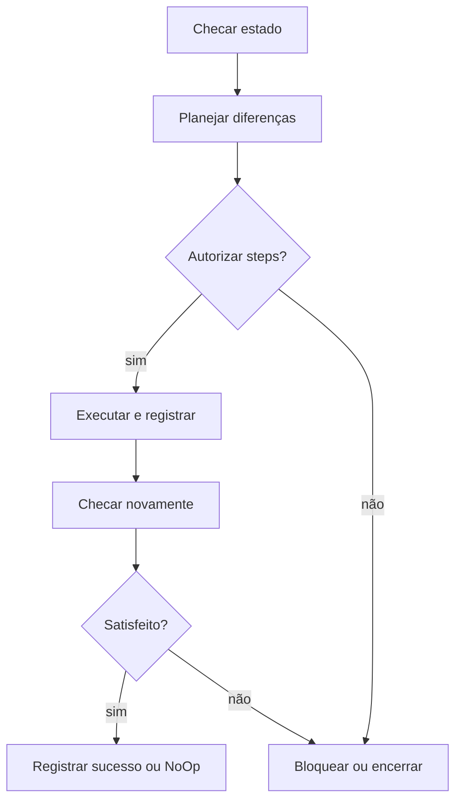

# Proposta de contrato YAML v2 para runbooks

Estado: **proposta de arquitetura, ainda não interpretada pelo executor**. Data: 2026-10-09.

[Plano](plano-de-execucao.md) · [Perfis de ambientes e versões](perfis-ambientes-versoes-v2.md) · [Script runner v2](script-runner-v2.md) · [Contrato PSD1 atual](runbooks.md) · [Arquitetura](arquitetura-executor.md)

## Decisão de desenho

Um runbook descreve o **estado desejado** e uma lista de tarefas. Cada tarefa declara as checagens que comprovam esse estado, as operações que corrigem pendências e as checagens que serão repetidas após a execução. O catálogo continua dinâmico: adicionar um runbook válido ao pacote deve fazê-lo aparecer na TUI sem recompilá-la.

A inspiração de Terraform fica nos parâmetros tipados, dependências, diferença entre estado observado e desejado e plano antes de aplicar. Terraform propriamente usa HCL ou JSON, não YAML. A inspiração de GitHub Actions fica em `steps`, `run`, `shell` e `env`; o DS1 não executará workflows ou actions do GitHub.

O YAML é **fonte de dados e scripts declarados**, não uma linguagem de expressões arbitrárias. O motor valida o documento, produz um plano fixado e executa arquivos ou blocos `run` em adaptadores conhecidos. Em `checks`, `run` deve apenas observar e produzir o resultado estruturado; em `apply`, pode modificar o destino após consentimento.

## Forma proposta

```yaml
apiVersion: ds1.dev/runbook/v2
kind: Runbook
metadata:
  id: windows.git
  title: Git for Windows
  category: Toolchains
  description: Instala ou adota uma versão compatível do Git.
  docs: docs/02.1-toolchain-windows.md

spec:
  target:
    kind: windows
    identity: initiating-user
  requires: [prerequisites]
  inputs:
    version:
      type: string
      default: stable
      description: Versão desejada do Git; stable é resolvido no plano.
  tasks:
    - id: git
      title: Conferir e preparar Git
      checks:
        - id: installed-version
          title: Versão instalada
          shell: pwsh
          file: scripts/Test-Git.ps1
          args:
            - {input: version}
          output: ds1.check/v1
      apply:
        - id: install
          title: Instalar a versão planejada
          fixes: [installed-version]
          when:
            anyRequired: [installed-version]
          shell: pwsh
          file: scripts/Install-Git.ps1
          args:
            - {input: version}
          approval: explicit
          timeoutSeconds: 1200
          reboot: block
```

O exemplo define a **forma** do contrato. Os scripts Git citados ainda não existem e o exemplo não deve ser apresentado como instalador pronto. O caminho `file` é relativo à pasta do runbook, deve permanecer dentro dela e identifica código publicado no mesmo pacote. `run: |` é alternativa a `file`, útil para poucos comandos simples; os dois campos são mutuamente exclusivos. Para lógica de versão, detecção e configuração com várias condições, preferir arquivos revisáveis.

### Campos e regras

| Campo | Semântica |
|---|---|
| `apiVersion`, `kind`, `metadata.id` | Contrato versionado, tipo fixo e identificador estável, independente do nome da pasta. |
| `metadata.category`, `title`, `description`, `docs` | Catálogo e detalhes da TUI; `docs` permanece dentro da documentação do pacote. |
| `spec.target` | Destino único ou `forEach` de um grupo de destinos do perfil. WSL fixa família, distribuição, release, imagem e instância; MSYS2 fixa raiz, arquitetura, imagem base e `MSYSTEM`. Sem alvo implícito por `shell`. |
| `spec.requires` | Dependências entre runbooks, resolvidas pelo motor com checagem real; o gate global `prerequisites` continua obrigatório mesmo se omitido. |
| `spec.inputs` | Parâmetros tipados (`string`, `boolean`, `integer`, `enum`, `path`, `version`), padrão ou referência `fromProfile`, e validação; valores resolvidos no Plan. |
| `tasks[].checks[]` | Sondas independentes, sem mutação. O resultado estruturado contém `satisfied`, `required` ou `error` e evidência. |
| `tasks[].apply[]` | Steps ordenados, cada qual com ID, checagens que corrige, condição estruturada, destino, interpretador e consentimento. |
| `shell` | Chave de um adaptador suportado no destino, não um comando arbitrário para procurar no PATH. |
| `file` / `run` | Código executado pelo adaptador selecionado. Arquivo e bloco inline usam script temporário no ambiente de destino, com exit code observado. |
| `variants` | Quando uma tarefa cobre vários destinos, define implementação própria por `windows`, `wsl` e `msys2` para cada checagem/step; falta de variante compatível bloqueia a tarefa. |
| `args`, `env` | Valores literais ou referências tipadas `{input: nome}`; o motor passa argumentos como vetor e variáveis de ambiente, sem interpolar texto YAML dentro de um comando. |
| `when.anyRequired` | Condição limitada a IDs de checagem; rejeitar IDs desconhecidos ou condições não compreendidas. |
| `approval`, `timeoutSeconds`, `reboot` | Consentimento de mutação, limite de execução e política de reinício (`block` inicialmente). |
| `capture`, `retry`, `workingDirectory` | Política de streams/log, repetição segura e diretório do destino, detalhados no [contrato do runner](script-runner-v2.md). |

`Plan` produz: valores resolvidos, origem/versão/hash de downloads quando houver, checagens e evidências, steps necessários, comando/argumentos exibíveis com segredos ocultos, identidade e destino efetivos. O motor calcula um hash desse plano; se as checagens, entradas ou artefatos mudarem antes do Apply, exige novo plano e autorização. Nunca assumir que `exit 0` prova o estado final.

## Checagem e estado por tarefa

Cada `check` devolve **um único objeto JSON** no stdout reservado ao protocolo. Diagnósticos vão para stderr ou para o canal de log. Exemplo:

```json
{"schema":"ds1.check/v1","state":"required","observed":"ausente","desired":"2.48.1","evidence":"git.exe não localizado"}
```

`required` é uma observação válida: a correção é necessária. Falha de acesso, JSON inválido, timeout ou código de saída inesperado vira `error`, jamais “ausente”. Todos satisfeitos → tarefa **Satisfeito**; nenhum satisfeito → **Requerido**; combinação → **Parcial**; erro em qualquer checagem → **Erro** e Apply bloqueado. O estado `Blocked` indica dependência ou permissão indisponível; `PendingReboot` suspende a sessão até nova sondagem.

O fluxo é serial por padrão:



Cada step registra ID, início/fim, destino, interpretador, comando exibível, argumentos com valores sensíveis ocultos, exit code, stdout/stderr, erro e resultado da verificação. A TUI mostra o erro da etapa e permite abrir o log; ao sair, oferece exportação dos logs. Falha interrompe os dependentes; rerun recomeça por checagem real, não pela posição registrada anteriormente. Não há rollback genérico.

O [script runner v2](script-runner-v2.md) define o processo coordenador que gera o contexto e as variáveis, prepara o interpretador por destino, transmite stdout/stderr simultaneamente à TUI e ao log e classifica o erro. `file`/`run` de um step são blocos opacos; para atribuir exit code e log a cada comando interno, decompor em steps ou instrumentar checkpoints explícitos. O status de `tee` jamais substitui o status real do script.

## Destino e interpretador são eixos independentes

| Destino | Identidade/instância obrigatória | Adaptadores iniciais propostos | Condição |
|---|---|---|---|
| `windows` | Token elevado e usuário iniciador para operações de perfil | `pwsh`, `powershell` (5.1, quando necessário), `cmd`, `python` | PS7 vem do bootstrap; Python somente se a versão Windows escolhida já existir ou vier de dependência explícita. |
| `wsl` | Nome da distribuição e usuário Linux explícitos | `bash`, `sh`, `python` | Exigir WSL2, distro inicializada e interpretador **dentro da distro**; nunca usar `python.exe` Windows. |
| `msys2` | Raiz da instalação e `MSYSTEM` (UCRT64 no escopo inicial) | `bash`, `sh`, `python` | Entrar no ambiente correto e resolver executáveis ali; não confundir MSYS2 Python/UCRT64 com Python Windows. |

Exemplos de sobrescrita, ilustrativos:

```yaml
# Dentro de um step de tarefa WSL
target: {kind: wsl, distro: {input: distro}, user: {input: linuxUser}}
shell: bash
file: scripts/linux/Test-Tool.sh

# Dentro de um step de tarefa MSYS2
target: {kind: msys2, root: {input: msysRoot}, msystem: UCRT64}
shell: python
file: scripts/msys2/Test-Tool.py

# Dentro de um step Windows
target: {kind: windows, identity: initiating-user}
shell: cmd
run: |
  where git >NUL 2>NUL
  exit /b %ERRORLEVEL%
```

O último bloco é apenas exemplo de sintaxe do adaptador; uma checagem v2 real deve emitir o objeto JSON e não tratar qualquer erro como ausência. `cmd` requer verificação explícita de `ERRORLEVEL`; `bash` deve tratar falhas de pipeline; PowerShell deve conferir também exit codes de executáveis nativos. O motor determina o caminho do interpretador no **destino**, cria script temporário com codificação apropriada, passa argumentos sem compor `-Command` com dados do usuário e controla saída/timeout/cancelamento.

MSYS2 oferece **vários ambientes/toolchains**, além de vários interpretadores que podem ser instalados. `UCRT64`, `CLANG64` e `MSYS` não são nomes de shell. A v2 começa com Bash, sh e Python; adaptadores opcionais futuros podem suportar zsh, Ruby, Perl, Node ou outro interpretador **somente** com instalação detectada, semântica de erro, codificação e testes específicos. A lista de nomes admitidos pertence ao pacote do executor; YAML desconhecido falha na validação e não é executado como comando livre.

O [perfil v2](perfis-ambientes-versoes-v2.md) permite selecionar Ubuntu 24.04 ou outra distribuição/release/imagem WSL homologada, bem como a instalação e o ambiente MSYS2. Ferramentas compartilhadas como Python, Java, Maven e Gradle recebem um pedido único e só entram em Apply depois de resolver **a mesma versão efetiva** em todos os destinos selecionados. Os artefatos e hashes continuam específicos de cada sistema. A lista de famílias candidatas não representa suporte automático: cada combinação requer imagem e adaptador homologados.

## Resolução e distribuição sem depender de Python no Windows limpo

O bootstrap mantém PowerShell 5.1 e seu fluxo atual; não interpreta YAML. Um compilador/validador **empacotado e pré-compilado para Windows**, acionado pelo motor PS7, lerá `runbook.yaml` e produzirá uma representação JSON versionada. O mesmo compilador valida no CI; na TUI, `R` recompila os manifestos locais e atualiza o catálogo sem recompilar a interface. O runtime distribuído traz esse componente: o usuário não instala Rust, Python, PyYAML ou módulo PowerShell para usar runbooks.

Até esse compilador, os `runbook.psd1`/`runbook.ps1` v1 continuam como executáveis canônicos. Não executar YAML v2 só por ele existir, nem permitir duas fontes executáveis com o mesmo ID. A migração será por runbook: v2 validado, adaptadores e testes de instalação/adopção/idempotência, então desativação do v1 correspondente. O preflight administrativo permanece compatível com o bootstrap durante a transição.

## Validação antes de habilitar v2

1. Definir schema verificável para IDs, tipos, referências, alvos, shells, condições e `apiVersion`; rejeitar chaves desconhecidas, âncoras/aliases cíclicos, duplicações de chaves e caminhos externos ao pacote.
2. Implementar compilador YAML → JSON normalizado e testes de equivalência no Windows/CI; não confiar em interpretação YAML implícita do PowerShell.
3. Implementar adaptadores Windows, WSL e MSYS2 com resolução da identidade e da instância, arquivos temporários, argumentos seguros, exit code, timeout e streaming de logs.
4. Implementar protocolo das checagens e do plano imutável; testar parcial, erro, NoOp, reinício e recusa em cada destino.
5. Migrar um runbook Windows pequeno e homologar em VM limpa e ambiente existente; depois WSL e MSYS2. Não marcar os instaladores históricos como concluídos pelo mero parse do YAML.
6. Implementar perfil de destinos, catálogo de imagens, lock de versões comum e matriz de compatibilidade antes de aplicar toolchains em vários ambientes.

## Referências de desenho

- [Sintaxe Terraform (HCL/JSON)](https://developer.hashicorp.com/terraform/language/syntax)
- [Sintaxe de workflows e shells GitHub Actions](https://docs.github.com/en/actions/reference/workflows-and-actions/workflow-syntax)
- [Comandos básicos WSL](https://learn.microsoft.com/en-us/windows/wsl/basic-commands)
- [Ambientes MSYS2](https://www.msys2.org/docs/environments/)
- [Python no MSYS2](https://www.msys2.org/docs/python/)
