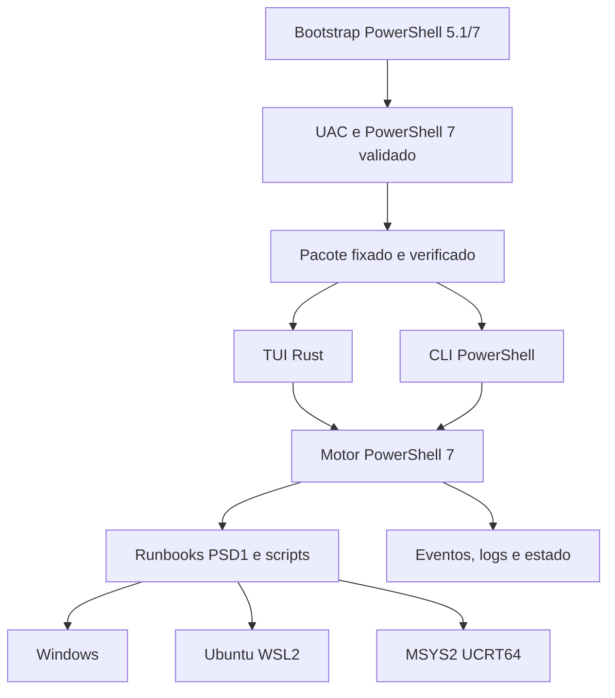

# Plano de execução — DS1 Dev Setup Utility

Data: 2026-10-09. Base inspecionada: `496b8fdecdc3f3ae8a5942ebfac55d90f2ac4b89`.
Status: **planejamento aprovado como direção de desenvolvimento; funcionalidades futuras não implementadas por este documento**.

[Índice](01-indice.md) · [Arquitetura](arquitetura-executor.md) · [Contrato atual](runbooks.md)

## 1. Objetivo e ponto de partida

Entregar um utilitário de terminal inspirado no Linutil, com bootstrap Windows PowerShell 5.1/PowerShell 7, motor PowerShell 7 e TUI (interface de usuário em terminal) Rust/Ratatui. Toda implementação, documentação, testes e planejamento são versionados neste repositório GitHub. `docs/` é a documentação canônica; a aba Wiki nativa não foi publicada e não deve virar uma segunda fonte manual divergente.

Dois cenários têm o mesmo nível de prioridade:

- **Windows limpo:** Windows 11 suportado, PowerShell 5.1 nativo, rede e possibilidade de consentir com elevação. Não presumir WinGet, Git, PowerShell 7, Terminal, Rust, .NET SDK, WSL, Ubuntu, MSYS2, 7-Zip ou pastas de workspace.
- **Ambiente existente:** descobrir instalações por usuário e máquina, versões, gerenciadores, distribuições, caminhos personalizados, profiles, mounts, caches e conflitos. Preservar o que existe; atualizar somente o que o plano aprovado especificar.

A expressão “sem instalar dependências da TUI” significa não exigir Rust/Cargo, compiladores, módulos PowerShell externos ou SDKs na máquina de destino. **PowerShell 7 é a exceção explícita**, instalável pelo bootstrap; os componentes escolhidos nos runbooks são a finalidade do produto. Download/extrair um pacote temporário não é execução somente em memória.

## 2. Inventário real antes do desenvolvimento

| Componente | Situação na base | Trabalho restante |
|---|---|---|
| `bootstrap.ps1` | Exige sessão elevada; instala PS7 via WinGet se disponível | UAC automático, ausência de WinGet, resolução confiável de PS7, pacote fixado e testes Windows |
| `src/ds1-setup.ps1` | Menu PowerShell e operações de linha de comando | Protocolo para TUI Rust, seleção em lote, versões e progresso |
| `src/Runbooks.psm1` | Descoberta PSD1, Test/Plan/Apply, grafo e pós-verificação | Capacidades, estado desejado estruturado, execução nativa e retomada |
| `runbooks/` | Dez manifestos históricos com `Implemented=$false` | Implementar e homologar cada instalador; criar manutenção/backup |
| Logs e estado | Transcript e observações JSON iniciais | Captura de subprocessos, escrita atômica, identidade por ambiente, recuperação |
| Testes | Suíte de contrato com 38 verificações na entrega anterior; workflow Windows/Linux | Executar novamente e adicionar testes de instalação em VMs reais |
| Documentação | Migração Markdown com exemplos e inconsistências remanescentes | Revisão integral de comandos, dependências, versões e navegação |
| Rust/releases | TUI Rust e pipeline de distribuição ausentes | Implementar, compilar em CI e publicar artefatos verificáveis |

Teste de contrato não comprova idempotência de instaladores nem homologação em Windows limpo. Não marcar um marco concluído apenas porque o script retorna código zero.

## 3. Adaptações à proposta inicial

1. Manter `bootstrap.ps1` como entrada pública; não criar `start.ps1` duplicado. Se um alias for necessário, deverá delegar à mesma implementação.
2. Suportar `irm URL | iex`, mas resolver **uma revisão/pacote imutável uma única vez**. Não baixar `main` novamente a cada elevação ou troca de shell. O primeiro script remoto continua sendo uma fronteira de confiança; hash obtido da mesma origem não protege contra comprometimento dessa origem.
3. Solicitar UAC (Controle de Conta de Usuário), nunca contorná-lo. Cancelamento encerra sem instalar. A UI operacional só inicia elevada. Não encerrar o terminal que chamou `iex` com `exit` indiscriminado.
4. WinGet não é pré-requisito do bootstrap. Disponibilizar fallback oficial para uma versão suportada de PowerShell 7, fixada pela release (MSI quando disponibilizado para aquela versão/arquitetura), com assinatura e hash verificados. Não construir URL presumindo que toda versão futura fornece MSI.
5. Reutilizar o motor e os manifestos PSD1. Rust recebe catálogo normalizado em JSON pelo motor, sem interpretar PSD1 nem duplicar a resolução de dependências. TOML não é necessário para cumprir descoberta dinâmica.
6. JSON possui suporte nativo no PowerShell; **YAML não possui parser nativo universal no PowerShell 7**. Não adicionar dependência YAML ao runtime. Paralelismo não é padrão para instaladores: locks e conflitos de pacotes exigem execução serial inicialmente.
7. `try/catch` com `$ErrorActionPreference='Stop'` não basta para falhas de todos os executáveis nativos. O executor deve conferir exit code e aplicar a política específica do provedor.
8. Rust deve restaurar raw mode, alternate screen e cursor em sucesso, erro, cancelamento e panic. Apenas alternar raw mode ao redor de `Command.status()` não implementa logging, progresso ou recuperação do terminal.
9. O exemplo `irm | iex` é PowerShell; no `cmd.exe` é necessário invocar `powershell.exe`/`pwsh.exe` explicitamente.
10. Não impor Ubuntu como dependência de MSYS2 ou MSYS2 como dependência de toolchain Windows. Numeração e ordem sugerida da wiki não substituem dependências técnicas.

## 4. Arquitetura alvo



Estrutura evolutiva, preservando os caminhos atuais:

```text
bootstrap.ps1
src/ds1-setup.ps1                 # CLI e menu atual durante a transição
src/Runbooks.psm1                 # motor existente
src/engine/                      # processos, estado, provedores e protocolo
ui/                              # Cargo.toml, Cargo.lock e fontes Rust futuros
runbooks/<id>/runbook.psd1
runbooks/<id>/runbook.ps1
runbooks/<id>/assets/             # Bash/configs opcionais do runbook
schemas/                         # contratos versionados futuros
release/                         # metadados/empacotamento futuros
config/                          # preferências declarativas, sem segredos
tests/                          # contrato, integração e cenários de VM
docs/                           # manual e decisões
```

Estado e logs do motor ficam fora do pacote, em ProgramData e segmentados por identidade; logs do bootstrap ficam no staging preservado. A árvore acima é planejada, não uma lista de arquivos já existentes. `config/catalog.psd1` é legado não consumido; removê-lo somente após conferir referências.

## 5. Contratos obrigatórios

### Bootstrap e identidade

Detectar arquitetura do SO e do processo, versão/edição do Windows, PowerShell e elevação antes de instalar. x64 é o primeiro alvo; ARM64 só entra no suporte anunciado após artefato e testes próprios. Reutilizar PS7 compatível, inclusive fora do PATH; não aceitar preview ou executável inesperado silenciosamente. Fixar a versão mínima testada no pacote, não “qualquer 7”.

Passar parâmetros de forma segura, preservando espaços e caracteres não ASCII, sem concatenar entrada do usuário em comandos. O fluxo remoto não pode depender de `$PSScriptRoot`. Usar staging exclusivo, com permissões restritas e verificação após elevação, evitando executar arquivos alteráveis por outra identidade privilegiada. Não remover dados de staging pertencentes a outra execução.

Registrar SID do usuário iniciador e identidade efetiva. Se UAC utilizar outra conta, bloquear configuração de HKCU/profiles/WSL até resolver explicitamente o usuário-alvo; a distro WSL pertence a uma conta Windows. Não presumir que elevação Windows produz root Linux, nem que filhos MSYS2 deixam de herdar o token elevado. Configurações devem ter proprietário/permissões corretos; operações Linux usam usuário explícito e sudo somente onde necessário.

### Runbooks e dependências

Preservar contrato v1 até disponibilizar migração testada. Evolução v2: ID estável sem dependência da numeração, referência à página, categorias, parâmetros por ferramenta, ambiente/instância, capacidades requeridas, conflitos, escopo, privilégios, versões suportadas, reboot e ações de recuperação. Grupos de página expandem tarefas granulares. Aliases mantêm IDs antigos durante a transição.

Test e Plan não alteram instalação/configuração; logs de diagnóstico são permitidos. Apply revalida antes de modificar. Verify é inicialmente um novo Test do estado desejado, não uma segunda implementação divergente. Dependências devem estar **observadas e saudáveis**: presença de `wsl.exe` não prova Ubuntu inicializado. Plano pode incluir dependências faltantes somente de forma visível e confirmada.

Grafo alvo: bootstrap → preparação Windows básica; dessa base saem WSL e MSYS2 independentemente. Workspace Windows depende do host; workspace Ubuntu depende da distro; workspace MSYS2 depende da instalação UCRT64. Toolchains dependem do próprio ambiente/workspace e das ferramentas efetivamente necessárias (Maven/Gradle → JDK compatível). Docker Desktop no backend WSL depende do WSL; integração Ubuntu depende também da distro. Shells básicos não dependem de todos os compiladores; completion de uma ferramenta depende dessa ferramenta. IDE local não depende de integrações remotas opcionais.

### Idempotência e versões

Inventariar → resolver estado desejado → planejar delta → confirmar → aplicar → verificar → persistir. Instalação compatível existente é registrada como descoberta externa; não reivindicar que foi instalada pelo DS1. Mesmo estado desejado deve produzir plano vazio e nenhuma reinstalação ou reescrita de arquivos na segunda execução.

Diferenciar ausente, conforme, divergente, parcial, conflito e inacessível. Não transformar erro de acesso em ausência. Atualização/downgrade, troca de gerenciador, alteração de versão padrão e migração de diretório são decisões explícitas. Instalar versão lado a lado quando suportado; preservar a anterior. Não apagar configuração de usuário. Só editar blocos gerenciados, com backup e comparação; conflitos externos bloqueiam a alteração.

Versão selecionada por ferramenta, incluindo distribuição do JDK e arquitetura. Resolver `latest` no Plan e fixar versão, URL e hash no plano; se mudar, exigir novo plano. Não substituir silenciosamente versão indisponível. APT/pacman não prometem qualquer versão histórica; respeitar repositórios e compatibilidade. Não substituir o Python de sistema Ubuntu. Rust/rustup, `.sdkmanrc`, venv e wrappers Maven/Gradle por projeto fazem parte do escopo avançado das toolchains.

### Logs, processos e persistência

Um executor comum inicia processos com argumentos separados, diretório e ambiente controlados, captura stdout/stderr continuamente e verifica exit code. Acrescentar timestamp, sequência de captura, runId, taskId, processo e ambiente; a ordem total original entre dois pipes não pode ser garantida. Cobrir UTF-8, CRLF, longas linhas, mensagens sem newline, volume alto, timeout, cancelamento e processos filhos.

Protocolo motor–Rust versionado: catálogo/planos/resultados JSON e eventos JSONL (um JSON por linha), com canal de controle separado da saída bruta dos instaladores. Não contaminar resultados com `Write-Host` ou stdout nativo. Eventos mínimos: started, output, progress, waiting-input, reboot-required, completed, failed, cancelled. Rust exibe saída em tempo real e permite rolagem; log em arquivo permanece completo após filtragem de segredos. Não prometer capturar uma janela gráfica como stdout. Tarefas interativas precisam de modo de terminal documentado, com limitações explícitas de captura; preferir interfaces não interativas suportadas.

Estado por host + SID + ambiente + distro/raiz MSYS2 + ferramenta. Registrar origem externa/DS1, versões desejada/observada, caminho, provedor, hash do runbook, release, evidências, plano, resultados, exit code e reinício pendente. Escrita atômica, schema versionado, lock por recurso e recuperação de interrupção. Históricos nunca substituem nova detecção.

Estados de execução alvo: Planned, Running, Succeeded, NoOp, Failed, Blocked, Cancelled, Interrupted, PendingReboot e NeedsInput. Separá-los do estado observado da ferramenta. Retomada explícita revalida ambiente/versões antes de continuar; não agendar tarefas persistentes sem opção explícita. Não fazer reboot automático ou repetir indiscriminadamente instalador após falha.

## 6. Marcos de implementação

Cada item aberto é trabalho futuro. A ordem respeita dependências técnicas; não são estimativas de prazo.

### M0 — Base documental e rastreabilidade

Dependências: nenhuma. Entrega: este plano e arquitetura vinculados ao README/índice.

- [x] Inspecionar a base publicada e registrar limitações reais.
- [x] Definir Windows limpo e ambiente existente como cenários obrigatórios.
- [x] Adaptar bootstrap, Rust e formatos ao motor existente.
- [ ] Auditar todos os comandos migrados, versões, placeholders e links/âncoras.
- [ ] Completar a separação preparação/toolchains/shells sem perder os procedimentos.
- [ ] Associar cada procedimento a tarefa granular e teste de aceite.

Aceite: zero procedimento sem página responsável; nenhum exemplo não homologado apresentado como instalação automática pronta.

### M1 — Bootstrap 5.1/7 independente de WinGet

Implementação inicial nesta rodada: verificação UAC, consentimento para elevação, detecção PS7, MSI oficial fixado 7.6.6 com hash/assinatura e consentimento, tratamento 3010, snapshot por commit e logs. Testes isolados não substituem homologação Windows; os itens abaixo permanecem abertos até seus respectivos critérios completos.

Dependências: decisões M0.

- [ ] Separar detectar/elevar/resolver PS7/obter pacote/iniciar; manter sintaxe 5.1.
- [ ] Tratar execução por arquivo e `irm | iex`, consentimento UAC e cancelamento sem loop.
- [ ] Descobrir PS7 compatível por caminhos confiáveis e validar versão real.
- [ ] Instalar PS7 ausente usando provedor oficial verificado, sem exigir WinGet/7-Zip/Git.
- [ ] Tratar exit codes de instalador, reinício pendente, PATH antigo e logs de bootstrap.
- [ ] Transferir contexto e mesma revisão entre processos; não fechar sessão chamadora.
- [ ] Baixar pacote imutável com retry limitado, verificar integridade e extrair com proteção contra caminhos externos; bloquear pacote incompleto/adulterado.

Aceite: VM Windows com apenas PS5.1 chega ao menu, tanto elevada quanto após UAC; cancelar UAC não instala; PS7 existente não é reinstalado. Validar x64, conta diferente na elevação, caminhos com espaços/acentos, falha de rede e ausência de WinGet. M1 usa menu PowerShell existente até M10.

### M2 — Motor, protocolo e execução de processos

Dependências: contrato M0; testes isolados independem de M1.

- [ ] Extrair serviço de execução da UI sem quebrar CLI/manifestos v1.
- [ ] Implementar executor Windows/WSL/MSYS2 com códigos, streaming, timeout e cancelamento.
- [ ] Criar protocolo JSON/JSONL com testes de compatibilidade e canais separados.
- [ ] Implementar fila serial, locks e prevenção de duas aplicações no mesmo recurso.
- [ ] Tratar falha nativa sem depender apenas de try/catch; retorno falho impede sucesso visual.

Aceite: subprocesso com saída simultânea, Unicode, stderr e exit code não zero aparece no console/log sem deadlock; cancelamento não registra sucesso; argumentos especiais não se transformam em comandos.

### M3 — Estado, planejamento, idempotência e retomada

Dependências: M2.

- [ ] Implementar inventário/estado desejado, journal e schema migrável com escrita atômica.
- [ ] Planejar diferenças e conflitos com hash do plano; invalidar plano obsoleto.
- [ ] Registrar instalações externas mesmo quando nenhuma instalação é necessária.
- [ ] Confirmar alterações do lote, revalidar dependências antes de cada tarefa.
- [ ] Persistir PendingReboot/Interrupted; retomar explicitamente sem repetir etapas conformes.
- [ ] Backups de configuração, detecção de alterações externas e compensações específicas.

Aceite: segunda execução conforme é NoOp; exclusão manual posterior é detectada; estado corrompido não autoriza instalação; falha intermediária bloqueia dependentes; reabertura recupera diagnóstico.

### M4 — Catálogo granular e provedores de versões

Dependências: M2/M3.

- [ ] Evoluir schema, IDs estáveis, grupos por página e aliases dos IDs atuais.
- [ ] Provedores WinGet, downloads oficiais, APT, SDKMAN e pacman com Test/Plan/Apply.
- [ ] Listar versões por ferramenta, cache com validade/origem e seleção individual.
- [ ] Verificar integridade, compatibilidade JDK–Gradle/Maven, arquitetura e instalação parcial.
- [ ] Declarar limites de pinning e atualização; nunca converter downgrade em upgrade genérico.

Aceite: adicionar pasta válida faz a tarefa aparecer sem alterar UI; manifesto/ciclo/dependência inválidos falham antes de qualquer Apply; Java/Maven/Gradle/Python aceitam escolhas distintas no mesmo lote.

### M5 — Preparação dos ambientes e Docker

Dependências: M1–M4.

- [ ] 02: WinGet/App Installer, PowerShell 7 reaproveitado, Terminal, Sysinternals e gsudo opcionais.
- [ ] 03: recursos WSL2, diagnóstico de virtualização, distribuição selecionável, inicialização do usuário e atualização controlada; não presumir nome fixo da distro.
- [ ] 04: instalação MSYS2 em raiz configurável, pacman, reabertura requerida e verificação UCRT64.
- [ ] 02/03 Docker: Desktop no Windows, pré-requisitos WSL, integração por distro e verificação CLI/Compose; sem instalar engine duplicada no Ubuntu.
- [ ] Separar tarefas Docker do preparo básico para evitar ciclo Windows → WSL → Windows.
- [ ] Etapas que exigem GUI/primeiro login retornam NeedsInput e são revalidadas; não declarar automação inexistente.

Aceite: WSL presente sem Ubuntu impede toolchain Ubuntu; MSYS2 falho impede UCRT64; Windows/MSYS2 independentes continuam disponíveis. Nenhuma distro/volume é apagado ou convertido sem plano explícito. Docker verifica engine/contexto sem interromper workloads automaticamente.

### M6 — Workspaces, compartilhamentos e caches

Dependências: M3 e cada ambiente de M5 correspondente.

- [ ] Criar raízes nativas separadas e `local/{bin,env,config}`, `dev/{cache,build,config,tools}`.
- [ ] PATH básico por ambiente, normalização Windows e comparação sensível a caixa Linux.
- [ ] Configurar permissões para usuário-alvo, sem chown recursivo de árvores existentes.
- [ ] Inspecionar symlinks/junctions/mounts; preservar destinos existentes e detectar conflitos.
- [ ] Mounts apenas dos recursos explicitamente compartilhados; editar fstab/wsl.conf preservando conteúdo.
- [ ] Redirecionamento de pastas pessoais opcional, considerando OneDrive e políticas; etapa manual assistida quando necessário.
- [ ] Configurar caches de Maven/Gradle/pip/build por ambiente sem compartilhar artefatos incompatíveis.

Aceite: workspaces Windows, Ubuntu e MSYS2 têm origens distintas; links e PATH não duplicam; arquivo/diretório preexistente nunca é removido como “correção”.

### M7 — Toolchains completas

Dependências: M4/M5/M6 por ambiente.

- [ ] 02.1 Windows: Git, Python/venv, JDK, Maven, Gradle, Notepad++, 7-Zip e WinRAR opcionais.
- [ ] 03.1 Ubuntu: Git, Python/pipx/venv, dependências SDKMAN, JDK/Maven/Gradle, GCC/G++, Make, Autotools, CMake/Ninja conforme escopo.
- [ ] 04.1 MSYS2: Git, GCC/G++, Autotools, Make, CMake/Ninja e bibliotecas UCRT64 pelo pacman.
- [ ] Variáveis HOME, seleção de padrão, precedência de PATH e testes em nova sessão pertencem à toolchain.
- [ ] Rust/rustup e toolchains por projeto opcionais nas páginas de cada ambiente; não requisito para executar DS1.
- [ ] Preservar versões existentes, caches, settings.xml/gradle.properties e credenciais Git; nunca recriar chaves de assinatura.

Aceite: builds mínimos Java/Maven/Gradle, Python venv e C/C++ por ambiente; versões reais correspondem ao plano; segunda execução é NoOp; versão alternativa não remove anterior.

### M8 — Shells e completion

Dependências: M6 e ferramentas selecionadas M7; não exigir toolchain inteira.

- [ ] Perfis PowerShell 5.1/7 mínimos, loader comum Windows e módulos compatíveis por edição.
- [ ] Bash Ubuntu/MSYS2 com loaders nativos independentes e inicialização explícita SDKMAN onde aplicável.
- [ ] Oh My Posh, PSReadLine, aliases e funções opcionais; histórico separado por shell.
- [ ] Completion de Git/Maven/Gradle/Docker Compose com descoberta de tarefas/serviços no momento de completar e cache invalidável.
- [ ] Backups e blocos gerenciados, sem downloads/builds durante a abertura do shell.
- [ ] Incorporar perfis Terminal criados pelas preparações sem duplicar GUIDs ou substituir settings do usuário.

Aceite: nova sessão de cada shell abre sem erro e completa comandos; profile prévio preservado; recarregar não duplica PATH/registro; ferramenta ausente desabilita somente seu complemento.

### M9 — IDEs, validação e recuperação

Dependências: M5–M8 conforme recurso.

- [ ] 06.1 VS Code/IntelliJ Windows, edição/gerenciador explícitos e integrações WSL/MSYS2; launchers com conversão de caminhos.
- [ ] 07 diagnóstico unificado `ds1-doctor`, relatórios por ambiente e verificações funcionais de builds/Docker/completion.
- [ ] 08 backup versionado de configs, manifests e estado, export WSL, inventário pacman e restauração em destino separado.
- [ ] Backups com segredos protegidos, política de retenção, teste de restauração e exclusão de caches/volumes ativos salvo backup consistente próprio.
- [ ] Atualização do utilitário e runbooks por pacote verificado, sem mudar o snapshot de uma sessão em curso; recuperação da release anterior.

Aceite: IDEs gráficas somente Windows; testes remotos reais; restauração em ambiente isolado recupera configurações e preserva dados; relatório distingue falha, ignorado, bloqueado e conforme.

### M10 — TUI Rust/Ratatui de produção

Dependências: protocolo M2 e planos/versões M3/M4; conclusão depende dos runbooks M5–M9.

- [ ] Criar crate em `ui/`, fixar dependências em Cargo.lock, compilar para Windows x64 em CI.
- [ ] Lista/categorias dinâmicas, busca, marcar/desmarcar, detalhes, ajuda e vínculo à documentação.
- [ ] Verificar, planejar, aplicar lote, selecionar versões e mostrar bloqueios/ações requeridas.
- [ ] Painel de stdout/stderr ao vivo com rolagem, progresso, caminho de log e resumo persistente.
- [ ] Teclas de cancelar/recarregar/retomar, resize, Unicode e fallback para CLI em terminal incompatível.
- [ ] Restaurar terminal inclusive em falhas de spawn, panic e Ctrl+C; não ocultar falhas do motor.

Aceite: novo runbook publicado no pacote aparece sem recompilar Rust; terminal utilizável após qualquer saída; instaladores não exigem Rust no destino; nenhum catálogo fixo ou regra por ferramenta na UI.

### M11 — Releases e homologação final

Dependências: todos os marcos anteriores.

- [ ] Pipeline Windows: testar PS5.1/PS7, motor, Rust, contratos, links e pacote completo.
- [ ] Publicar ZIP com TUI + motor + runbooks + schemas + documentação/licenças e metadados de compatibilidade.
- [ ] Gerar checksums e assinatura/proveniência verificável quando disponível; documentar a raiz de confiança e limites.
- [ ] Homologar bootstrap pelo artefato publicado em VMs limpas; runner hospedado não substitui esse teste.
- [ ] Documentar comando remoto real somente quando a release existir e for testada; não deixar URLs fictícias executáveis.
- [ ] Registrar evidências, limitações, changelog e recuperação por release; só então anunciar instalador completo.

Aceite: instalação limpa e atualização de ambiente montado passam pela matriz abaixo; nenhum item do escopo anunciado depende de `Implemented=$false`.

## 7. Matriz de cobertura da wiki

| Página | Entregas/marcos | Evidência obrigatória |
|---|---|---|
| [01 Índice](01-indice.md) | M0, grafo M4 | Navegação e ordem sem dependências artificiais |
| [02 Windows](02-windows.md) | M1/M5 | PS5.1 sem WinGet → PS7; utilitários e Docker preservados |
| [03 WSL](03-wsl.md) | M5 | Distro WSL2 inicializada, usuário correto, integração Docker |
| [04 MSYS2](04-msys2.md) | M5 | UCRT64 funcional, pacman e raiz customizada |
| [05 Pastas](05-workspaces.md) | M6 | Raízes isoladas, PATH, mounts e caches sem perda |
| [02.1 Windows](02.1-toolchain-windows.md) | M7 | Versões selecionadas e builds nativos |
| [03.1 Ubuntu](03.1-toolchain-ubuntu.md) | M7 | SDKMAN/Python/build Linux sem executáveis Windows |
| [04.1 MSYS2](04.1-toolchain-msys2.md) | M7 | GCC/Autotools/build UCRT64 |
| [06 Shells](06-shells.md) | M8 | Perfis individuais, prompt/completion em nova sessão |
| [06.1 IDEs](06.1-ides.md) | M9 | IDE Windows e abertura de projetos WSL/MSYS2 |
| [07 Validação](07-validacao.md) | M9/M11 | Doctor, rerun, drift e logs completos |
| [08 Backup](08-backup.md) | M9/M11 | Backup restaurado e atualização recuperável |
| [Runbooks](runbooks.md) | M2/M4/M10 | Adição dinâmica sem alteração da TUI |
| [Executor](arquitetura-executor.md) | M1–M4/M10/M11 | UAC, plano, eventos, persistência e release |

## 8. Matriz mínima de testes de entrega

| Cenário | Resultado exigido |
|---|---|
| Windows limpo, PS5.1, sem WinGet/Git/Terminal | Bootstrap chega à UI com PS7 verificado |
| PS7 existente fora do PATH ou múltiplas versões | Seleção compatível explícita; nada sobrescrito |
| UAC recusado ou solicitado com outra conta | Cancelamento limpo ou bloqueio de escopo de usuário |
| Ambiente já configurado e paths personalizados | Inventário externo, configuração preservada |
| Reexecução com o mesmo estado desejado | Sem instalação/duplicação/reescrita desnecessária |
| Instalação parcial ou drift após sucesso anterior | Diagnóstico real, reparo planejado e verificável |
| WSL sem distro, distro WSL1 ou usuário não inicializado | Dependentes Ubuntu bloqueados com motivo |
| MSYS2 presente sem UCRT64 funcional | Toolchain MSYS2 bloqueada; host não bloqueado |
| Versão inexistente/incompatível ou hash errado | Bloqueio antes de Apply; sem fallback silencioso |
| Rede interrompida, proxy ou certificado inválido | Erro explicável, retry limitado, nenhuma redução de TLS |
| stdout/stderr intensos, Unicode e saída sem newline | Streaming/log sem deadlock; erro e exit code preservados |
| Reboot, cancelamento ou queda durante instalação | Estado não marcado sucesso; retomada após revalidação |
| Duas execuções concorrentes | Lock impede mutação concorrente do mesmo recurso |
| Perfis/links/mounts preexistentes divergentes | Backup/conflito; não destruir conteúdo |
| Novo runbook ou schema incompatível | Descoberta dinâmica ou erro claro antes da execução |
| Backup/restauração e troca de release | Dados recuperáveis e estado revalidado |

## 9. Definição de concluído por tarefa

- Código, manifesto, documentação detalhada, parâmetros/versões e dependências no mesmo commit ou PR.
- Test/Plan sem mutação de configuração; Apply condicional; pós-verificação real com evidência.
- Instalação limpa, adoção de instalação externa, segunda execução e falha intermediária testadas.
- Logs/estado por ambiente, códigos nativos e reinício tratados; segredos omitidos.
- Nenhum requisito novo para executar a UI; dependências das tarefas declaradas.
- Navegação, exemplos e limitações atualizados. Não marcar teste de VM como realizado quando só houve mock ou teste Linux.
- `Implemented=$true` somente para rotina homologada; marcos permanecem abertos até evidência no repositório.

Próxima entrega recomendada: **M1 + fundação M2**, usando a UI PowerShell atual. Em seguida M3/M4 e primeira fatia vertical de instalação (Git Windows) com adoção, logs e reexecução; só expandir para os demais provedores depois desse aceite. Isso não elimina nenhum requisito da TUI Rust: evita desenvolver uma segunda engine dentro dela.

## Referências técnicas

- [PowerShell no Windows: WinGet, MSI e ZIP](https://learn.microsoft.com/en-us/powershell/scripting/install/install-powershell-on-windows)
- [PowerShell: variáveis de preferência e erros nativos](https://learn.microsoft.com/en-us/powershell/module/microsoft.powershell.core/about/about_preference_variables)
- [Linutil — referência de experiência de terminal](https://github.com/ChrisTitusTech/linutil)

Revalidar requisitos de fornecedores na implementação de cada provedor. Versões de bibliotecas Rust sugeridas em exemplos não são pins aprovados do projeto.
