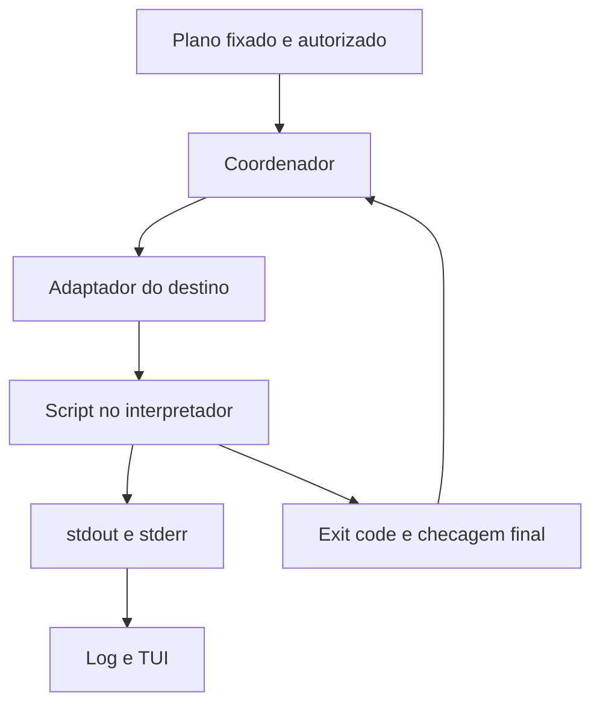

# Script runner v2 — contrato de execução por interpretador

Estado: **especificação proposta; ainda não implementada**. Data: 2026-10-09.

[Runbooks YAML v2](modelo-runbooks-v2.md) · [Perfis de ambientes](perfis-ambientes-versoes-v2.md) · [Plano](plano-de-execucao.md)

## Fronteira de responsabilidade

O **coordenador** recebe um step já resolvido e autorizado, escolhe um adaptador `target + shell`, cria o contexto, abre os arquivos de log, inicia o processo e captura seu resultado. O **adaptador** resolve um interpretador verificado e prepara o script no ambiente certo. O **script** executa a checagem ou correção e informa resultados específicos do domínio. A TUI consome eventos; não executa comandos diretamente.

O runner não interpreta uma string livre como linha de comando host. `file` e `run` são mutuamente exclusivos; `args` é um vetor tipado. `run` vira arquivo temporário de script, nunca concatenação de valores do usuário em `-Command`, `bash -c` ou `cmd /C`. Um step com vários comandos é uma **unidade de falha e consentimento**; para log/estado por comando, dividi-lo em steps ou usar uma API de checkpoints instrumentada. Não prometer detectar internamente cada comando de um bloco opaco.



## Campos do step e contrato de entrada

```yaml
- id: install-python
  title: Instalar Python escolhido
  target: {ref: ubuntu}
  shell: bash
  file: scripts/linux/Install-Python.sh
  args:
    - {input: version}
  env:
    PYTHON_DESIRED_VERSION: {input: version}
  workingDirectory: {targetTemp: true}
  timeoutSeconds: 1200
  approval: explicit
  retry: {mode: none}
  capture: {stdout: true, stderr: true, terminal: mirror}
```

O exemplo mostra a forma pretendida; o arquivo e o adaptador ainda não existem. `terminal: mirror` significa que o coordenador mostra os chunks recebidos na TUI **e** os grava; não executa `script | tee`. `capture` não oferece um modo que descarte o erro ou o exit code de um step mutável. Um `run: |` simples pode substituir `file` sob as mesmas regras.

| Entrada | Regra |
|---|---|
| `target` | Identifica Windows, instância WSL + usuário ou raiz + MSYSTEM do MSYS2. Pode vir do perfil; nunca inferir a distro padrão do WSL. |
| `shell` | Nome de adaptador permitido no destino; o plano fixa o caminho real e versão do executável. Interpretador ausente gera `InterpreterUnavailable`. |
| `args` | Vetor de argumentos literais/referências tipadas. O runner aplica quoting conforme o processo e o destino; não interpola strings dentro de `run`/`file`. |
| `env` | Mapa de valores literais/referências tipadas, com nomes validados e sem colisões por diferenças de caixa no Windows. `DS1_*` é reservado ao motor. |
| `workingDirectory` | Diretório existente, no **destino**, resolvido e validado; recusar traversal ou conversão ambígua de caminhos. |
| `timeoutSeconds`, `retry` | Limites explícitos. Retry `none` por padrão; tentativas de rede só com política do provedor e operação comprovadamente segura de repetir. |
| `capture` | Dois pipes separados para stdout/stderr, timestamps/ordem de chegada e logs completos, com UI em buffer limitado. Modo de terminal interativo terá protocolo e limites próprios. |

O coordenador monta um ambiente mínimo a partir das variáveis essenciais do destino, mais os inputs autorizados. Antes de iniciar, cria `context.json` com valores tipados e referências aos arquivos da etapa. Variáveis exportadas incluem `DS1_RUN_ID`, `DS1_TASK_ID`, `DS1_STEP_ID`, `DS1_TARGET_ID`, `DS1_CONTEXT_FILE`, `DS1_OUTPUT_FILE` e `DS1_TEMP_DIR`. A representação dos caminhos nessas variáveis é **nativa do destino**. Variáveis criadas por um step não persistem implicitamente no seguinte; saídas aprovadas são gravadas em `DS1_OUTPUT_FILE`, validadas pelo motor e só então passadas adiante. Não passar segredo no argumento exibível, linha de comando registrada ou YAML; eventual credencial usa canal/arquivo temporário com acesso restrito e ocultação no log.

O runner deve conferir se o script e o interpretador vêm da revisão/pacote autorizado. Falha para preparar contexto, criar arquivo de log ou garantir permissão adequada impede iniciar um novo Apply. O processo filho não escreve `result.json` de autoridade: o coordenador é responsável pelo resultado final.

## Arquivos temporários e logs

| Local | Conteúdo | Retenção |
|---|---|---|
| `%ProgramData%\DS1DevSetup\runs\<runId>\<targetId>\<taskId>\<stepId>\` | Staging Windows com ACL do usuário/identidade efetiva, script, contexto e saídas do processo. | Limpeza controlada depois de consolidar logs, nunca antes do resultado e diagnóstico. |
| Diretório temporário privado da **distro e do usuário WSL** | Script/contexto Linux com permissões restritas; ponte com host validada. | Remover após entrega e verificação; falha de cópia permanece registrada no host. |
| Diretório privado na raiz/identidade MSYS2 escolhida | Script/contexto com caminhos convertidos de forma validada para o ambiente MSYSTEM. | Mesma regra do WSL, sem mexer em instalação ou arquivos do usuário. |
| `%ProgramData%\DS1DevSetup\logs\<runId>\...` | `events.jsonl`, `stdout.log`, `stderr.log`, `result.json` por etapa, mais índice da sessão. | Persistente; exportável ao sair. Rotação/retention é política futura, sem apagar diagnósticos da sessão atual. |

Os nomes reais são sanitizados e o índice mapeia IDs originais para caminhos. O coordenador é o único gravador do journal de eventos; scripts não podem usar um caminho fornecido pelo usuário para substituir logs. Dados sensíveis conhecidos são ocultados **antes** de ir ao arquivo ou à TUI. Se o step puder emitir segredo que o motor não consegue reconhecer, o payload dessa saída deve ser suprimido e sinalizado no evento; metadados e status continuam registrados. Logs exportados ainda devem ser revisados antes de compartilhar. Se o armazenamento falhar durante Apply, marcar falha de observabilidade/execução, parar novos steps e reavaliar o estado ao retomar; não declarar sucesso só porque o filho encerrou com zero.

## Tee, saída estruturada e status real

Abrir stdout e stderr como streams independentes, drená-los continuamente e anexar cada chunk aos arquivos próprios após aplicar a política de ocultação. Para a TUI, emitir eventos com `runId`, `taskId`, `stepId`, `stream`, timestamp, sequência de captura, offset no arquivo persistido e texto decodificado quando possível. Preservar os bytes do conteúdo **não ocultado**, inclusive saída sem newline; registrar erros de decodificação e marcador quando houver ocultação/supressão. A sequência é **de chegada ao coordenador**: não inventar uma ordem causal perfeita entre pipes diferentes. Limitar memória da TUI sem truncar conteúdo permitido no log persistente. ConPTY, quando necessário para programa interativo, pode mesclar canais e será rotulado `terminal`, não como stdout/stderr falsamente separados.

O status do bloco vem do **processo do interpretador** (spawn, exit code, timeout ou cancelamento), acrescido da verificação de estado posterior. `exit 0` significa apenas que o processo terminou sem erro sinalizado; não prova que o requisito foi satisfeito. Em `checks`, stdout é reservado a **um JSON `ds1.check/v1`** com limite de tamanho, que também pode ser preservado no log; diagnostics usam stderr/eventos. Em `apply`, stdout/stderr são logs livres e outputs tipados usam o arquivo de controle separado.

Exemplo de evento e resultado escritos pelo **coordenador** (valores fictícios):

```json
{"schema":"ds1.runner.event/v1","runId":"r-001","taskId":"python@ubuntu","stepId":"install","sequence":17,"stream":"stderr","offset":2048,"bytes":42,"at":"2026-10-09T13:00:00Z"}
```

```json
{"schema":"ds1.runner.result/v1","runId":"r-001","taskId":"python@ubuntu","stepId":"install","status":"failed","exitCode":1,"error":{"kind":"CommandFailed","retryable":false,"message":"Processo encerrou com código 1"},"logs":{"events":"events.jsonl","stdout":"stdout.log","stderr":"stderr.log"}}
```

`result.json` é escrito atomicamente após o processo sair e os pipes serem drenados. Um crash sem resultado final gera `Interrupted` na reabertura; o motor usa novamente Test antes de considerar uma repetição. A TUI mostra caminho, comando sanitizado, código nativo e motivo; ao sair, oferece copiar os logs consolidados para destino escolhido, sem sobrescrever. O transcript PowerShell existente continua como apoio durante a migração, mas não substitui a captura dos processos filhos.

## Ciclo de vida de comando para indicadores `running`

**Contrato proposto; não implementado.** O coordenador publica eventos de transição **além dos chunks de stdout/stderr**. A TUI PowerShell atual e a Rust futura consomem o mesmo conceito de ciclo de vida, sem emitir frames de spinner no log ou dentro do processo filho.

| Evento | Origem real | Efeito no renderer |
|---|---|---|
| `command.started` | Spawn do processo/ação confirmado | Iniciar contador e spinner na linha do comando sanitizado |
| `command.waiting` | Aguardando UAC, aprovação, credencial ou input que exige intervenção | Suspender animação; mostrar `Aguardando ação` e motivo seguro |
| `command.resumed` | Aguardando ação resolvido e processo ativo | Retomar spinner se ainda houver execução |
| `command.finished` | Processo encerrou e streams foram drenados | Desligar spinner; exibir exit code, duração e estado de verificação |
| `command.interrupted` | Reconciliação após crash/quebra de canal sem status confiável | Desligar spinner e exibir `Interrompido/Estado desconhecido` |

O envelope do evento inclui `schema=ds1.runner.event/v1`, `eventType`, `runId`, `taskId`, `stepId`, `commandId`, `sequence`, `at` e estado tipado. Eventos de início incluem `displayCommand` **sanitizado**; término contém `exitCode`, `durationMs`, `outcome` (`succeeded`, `failed`, `cancelled`, `timed_out`, `reboot_required`, `start_failed`) e eventual resultado posterior `verified`. O status visual `Concluído` exige `verified=true` quando houver pós-condição; caso contrário mostrar `Comando encerrado, verificando` ou motivo apropriado. `start_failed` não gera `command.started`. Duplicatas e eventos fora de ordem devem ser idempotentes pelo identificador e número de sequência; uma conclusão nunca retorna a `running` por evento atrasado.

Exemplo de evento estruturado, fictício, registrado **uma vez**, não por quadro da animação:

```json
{"schema":"ds1.runner.event/v1","eventType":"command.started","runId":"r-001","taskId":"python@ubuntu","stepId":"install","commandId":"install-01","sequence":1,"at":"2026-10-10T04:00:00Z","displayCommand":"uv tool install specify-cli"}
```

A UI renderiza frames locais por relógio, mantendo animação durante silêncio de stdout/stderr e para todos os processos vivos identificados. O relógio não é prova de atividade. Em reabertura, consultar processo/supervisor para reconciliar eventos abertos; na impossibilidade, registrar `Interrupted`, não deixar um spinner infinito. Etapas opacas não permitem prometer ícone para cada instrução interna; usar steps separados ou checkpoints instrumentados para esse nível de detalhe. O título do terminal é recurso **opt-in** da UI, não do runner; consultar [padrão visual TUI](tui-windows.md#indicador-animado-de-comandos-em-execução-running).

## Adaptadores e semântica de erro

| Destino + interpretador | Preparação/execução proposta | Critério de falha do bloco |
|---|---|---|
| Windows `pwsh` | Executável PS7 aprovado, `-NoProfile -NonInteractive -File <script>`; prologue de erros terminantes e helper para comandos nativos. | Exception, erro terminante ou exit code propagado. Comandos nativos internos precisam de checagem individual; `$ErrorActionPreference` sozinho não garante isso. |
| Windows `powershell` | Executável 5.1 somente em steps declarados compatíveis; codificação e argumento homologados. | Mesma regra, sem presumir recursos PS7. Bootstrap é fluxo separado. |
| Windows `cmd` | `%ComSpec%` verificado, arquivo `.cmd`, argumentos controlados. | Cada comando relevante checa `ERRORLEVEL`/`exit /b`; `cmd` não ganha fail-fast automaticamente. Preferir steps curtos. |
| Windows `python` | Python da versão/provedor selecionados no plano, com saída não bufferizada quando aplicável. | Exit code/traceback do script; subprocessos Python usam `subprocess.run(..., check=True)` ou verificam `returncode`. |
| WSL `bash`/`sh`/`python` | `wsl.exe` com distro e usuário explícitos, executável **dentro da distro** e script staged no filesystem Linux. `bash` tem política testada de `set -Eeuo pipefail`; `sh` não pressupõe `pipefail`. | Exit code do processo WSL e do interpretador, com distinção de falha de inicialização da distro. Verificar checagens em nova chamada. |
| MSYS2 `bash`/`sh`/`python` | Raiz e MSYSTEM selecionados, login shell/launcher homologado para compor PATH; intérprete do ambiente, não Python Windows por acidente. | Exit code do interpretador e verificação de MSYSTEM/caminhos antes de rodar; falha de inicialização do ambiente é erro distinto do script. |

Mais interpretadores no MSYS2 (zsh, Ruby, Perl, Node etc.) exigem um adaptador com contrato de argumentos, codificação, erros e teste; `shell` arbitrário não vira execução livre. Checagens para instalar Python não podem depender do próprio Python ainda ausente. Cada família WSL precisa das capacidades do interpretador realmente disponíveis naquela imagem.

## Taxonomia de falhas

| `error.kind` | Quando emitir | Reação inicial |
|---|---|---|
| `TargetUnavailable` | Distro/usuário WSL, raiz/MSYSTEM ou host alvo inacessível. | Bloquear e oferecer diagnóstico da instância. |
| `InterpreterUnavailable` / `InterpreterStartFailed` | Binário da versão selecionada ausente, inválido ou impossível de iniciar. | Bloquear steps dependentes; não procurar outro PATH silenciosamente. |
| `CommandFailed` | Script/processo terminou com código não zero ou reportou erro de comando. | Mostrar comando, exit code e streams; Test antes de tentar novamente. |
| `NetworkFailure` | Provedor entregou sinal verificável de DNS, conexão, TLS ou HTTP com metadados pertinentes. | Mostrar subtipo e origem; retry só se a operação/política permitir. Um exit code genérico não basta para classificar como rede. |
| `InvalidCheckResult` | Check terminou sem JSON único válido, schema incorreto ou evidência incompatível. | Marcar Erro; não converter em Requerido. |
| `Timeout` / `Cancelled` / `Interrupted` | Limite atingido, usuário cancelou ou sessão terminou sem resultado. | Drenar saída, tentar encerrar árvore de processos e reavaliar o estado na retomada. |
| `PostCheckFailed` / `PendingReboot` | Processo terminou mas estado final não satisfez; ou alteração exige reinício. | Não marcar sucesso; suspender dependentes e rechecá-los após reinício. |
| `LogWriteFailed` | Falta espaço/permissão para o registro obrigatório. | Não iniciar novos steps; preservar o erro e reavaliar o estado. |

Registrar `phase`, `origin` (coordenador, adaptador ou script), código bruto do SO/provedor e `retryable` separado da categoria. Não transformar mensagem textual de instalador em diagnóstico certo. Uma exceção inesperada é `InternalError` com causa original redigida e caminhos de log, sem mascará-la como rede.

## Critérios de aceite do runner

1. Runner de teste em cada ambiente transmite stdout e stderr simultâneos, Unicode, CRLF, saída enorme e sem newline, sem deadlock, com log persistente íntegro e TUI responsiva.
2. Pipeline ou bloco interno que falha produz status de falha real no step, inclusive PowerShell nativo, Bash pipe e CMD `ERRORLEVEL`; caso impossível de inferir de bloco opaco, exigir helper/checkpoints ou dividir o step.
3. Falha de spawn, target inexistente, JSON inválido, erro HTTP/DNS/TLS conhecido, timeout, Ctrl+C e crash geram categorias corretas e logs consultáveis; rede genérica não é inferida só pelo exit code.
4. Argumentos com espaços, acentos, aspas e caracteres especiais não viram código; variáveis geradas e outputs tipados não vazam entre steps/destinos.
5. Segredo de teste é omitido dos eventos, terminal e export; staging é privado, saída persistente é gravada antes da limpeza e exportação não sobrescreve.
6. Reexecução de uma instalação parcial começa por Test, não usa resultado antigo como prova nem repete automaticamente operação sem segurança de idempotência.
7. Homologar Windows Console Host/Terminal, PowerShell 5.1/7 quando declarados, WSL distro/usuário específico e MSYS2 UCRT64 em raiz padrão/personalizada. Runner hospedado de CI não substitui VM limpa.

## Referências

- [Exit status de comandos nativos PowerShell](https://learn.microsoft.com/en-us/powershell/module/microsoft.powershell.core/about/about_automatic_variables)
- [Transcrição de sessão PowerShell](https://learn.microsoft.com/en-us/powershell/module/microsoft.powershell.host/start-transcript)
- [Shell e exit codes em GitHub Actions](https://docs.github.com/en/actions/reference/workflows-and-actions/workflow-syntax)
- [Subprocessos Python](https://docs.python.org/3/library/subprocess.html)
- [Distro/usuário WSL](https://learn.microsoft.com/en-us/windows/wsl/basic-commands)
- [MSYSTEM e ambiente MSYS2](https://www.msys2.org/docs/environments/)
