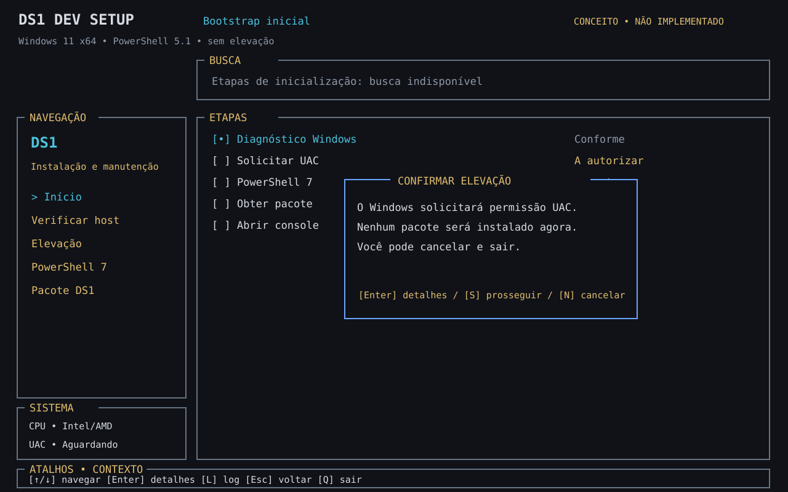
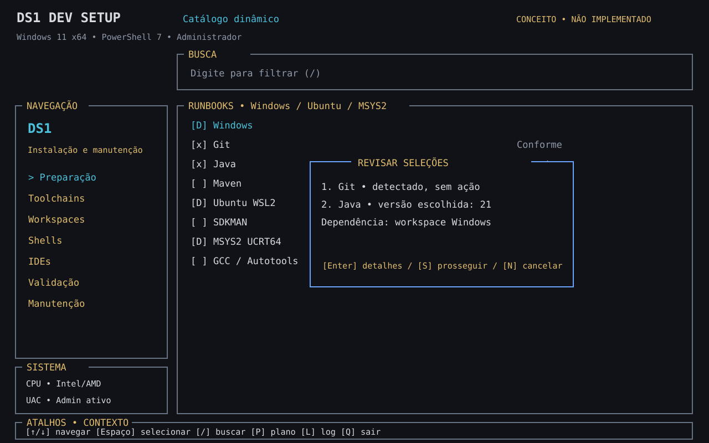
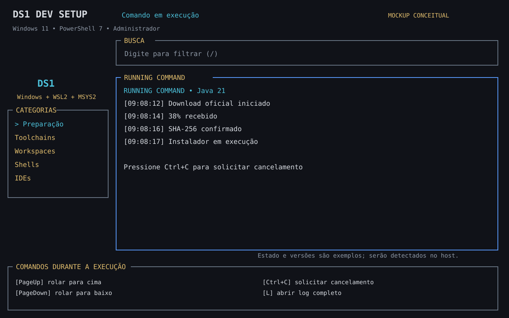

# TUI Windows — experiência inspirada no Linutil

Status: **especificação e mockups conceituais; primeira TUI PowerShell funcional, TUI Rust pendente**. Data: 2026-10-09.

Incremento funcional: estados Satisfeito/Requerido/Parcial por tarefa, Erro após falha de execução, tecla **L** para eventos detalhados e pergunta de exportação dos logs ao sair. O painel expandido de fases, seleção em lote, console rolável e TUI Rust desta especificação ainda são metas futuras.

[Índice](01-indice.md) · [Plano M0–M11](plano-de-execucao.md) · [Executor](arquitetura-executor.md)

## Direção visual e referência

Adotar uma interface de terminal semelhante ao Linutil: fundo escuro, painéis delimitados, navegação por categorias, árvore/lista de tarefas, descrição contextual, foco visível, busca e ajuda de teclado. Identidade e textos serão DS1, em português; não reutilizar logotipo CTT.

Referência inspecionada: [Linutil](https://github.com/ChrisTitusTech/linutil/tree/0b0f7449e79275a7ad5cd1c0dee48c6d71f1f7f1), incluindo preview oficial, `tui/src/theme.rs`, `hint.rs` e `running_command.rs`. O código de referência usa terminal virtual para comandos e permite salvar seu log; DS1 exige gravação automática contínua e buffers de tela limitados. Não transpor o executor baseado em `sh -c` para Windows.

As três capturas enviadas pelo usuário foram inspecionadas: Linutil em Ubuntu-26.04 no Windows Terminal, inclusive catálogo multiseleção e comando em execução. Elas mostram busca no topo, marca acima de um box **pequeno** de categorias à esquerda, box **maior** de itens à direita com indicadores `[D]` e `[*]`, confirmação sobreposta e um box inferior de comandos de navegação. Durante uma instalação, a saída ocupa o box da direita e o rodapé troca os atalhos conforme o contexto. Os mockups refletem essa composição, com marca própria DS1 e estados de instalação Windows.

## Duas etapas com a mesma linguagem visual

### 1. Bootstrap: PowerShell 5.1 nativo

A tela inicial deve existir **antes** de PowerShell 7, WinGet e Windows Terminal. Usar `System.Console`/recursos nativos, sem módulos externos, fontes especiais, download de UI ou compilação. Não implementar novamente um catálogo de runbooks aqui: o bootstrap só prepara o executor.

- Cabeçalho: DS1 Dev Setup, fase “Inicialização”, Windows/arquitetura, shell atual, usuário e estado de elevação.
- Busca na faixa superior: desativada durante as poucas etapas fixas do bootstrap; permanece visível para manter a composição.
- Esquerda: marca DS1 acima de um box compacto de categorias/etapas. O espaço restante não precisa ser preenchido; dados do host entram no cabeçalho ou em detalhes.
- Direita: box principal maior com requisitos e estados observados, na mesma posição em que o console exibirá os comandos ao executar. Valores desconhecidos aparecem como “Verificando” ou “Não verificado”, nunca como sucesso.
- Janela sobreposta: consentimento contextual para UAC, instalação do MSI ou pacote DS1, sempre com efeitos e opção de cancelar.
- Rodapé: box de comandos de navegação, com duas colunas e teclas dependentes do contexto. Log completo por tecla L e indicação persistente de seu caminho. Uma falha conserva a mensagem em janela sobreposta. A opção inicial de qualquer confirmação de instalação é “Cancelar”.

Estados visuais devem refletir observação real: “Encontrado”, “Ausente”, “Inacessível”, “Aguardando autorização”, “Em execução”, “Falhou”, “Reinício necessário”. Cor é complementar ao texto. Um candidato inacessível a pwsh.exe aparece como aviso, mas não interrompe a busca por outros candidatos válidos.

O exemplo do mockup mostra Windows limpo; ele não representa o estado real da máquina do usuário.

### 2. Console de runbooks: Rust + Ratatui

Depois de PS7 compatível validado e pacote verificado, abrir a interface completa com o mesmo tema. Categorias e tarefas vêm do motor, usando os manifestos dinâmicos; adicionar runbook não exige recompilar Rust.

| Região | Conteúdo e comportamento |
|---|---|
| Cabeçalho | Versão DS1/revisão, usuário, administrador, ambiente e instância selecionados |
| Busca no topo | Filtro incremental por título, ID e ferramenta; desliga atalhos globais enquanto o campo recebe texto |
| Box de categorias à esquerda, aproximadamente 23% da largura | Marca acima; categorias dentro de um box compacto cuja altura acompanha os itens, deixando espaço livre abaixo |
| Box principal à direita, aproximadamente 77% da largura | Diretórios e runbooks, seleção em lote, estado observado, versão e dependência bloqueante; ocupa a maior parte da altura |
| Janelas sobrepostas | Detalhes da tarefa, seleção de versão, plano, confirmação e diagnóstico de falha; nenhuma instalação por Enter na lista |
| Box inferior em toda a largura | Lista explícita de comandos pertinentes ao foco, em colunas, como nas capturas de referência |
| Console de execução | Ocupa o mesmo box principal da lista, com saída contínua, rolagem e caminho do log automático; o box inferior passa a mostrar atalhos de execução |

Mostrar ambiente como Windows / Ubuntu WSL2 / MSYS2, e a instância específica (nome da distro ou raiz MSYS2). Não confundir “pacote instalado” com “configuração validada”. Uma tarefa bloqueada permanece visível, com motivo e opção de incluir o pré-requisito no plano; não instalar dependências silenciosamente.

## Fluxo do bootstrap e consentimentos

1. Abrir a tela nativa e detectar host/terminal sem alterar configuração.
2. Exibir necessidade de elevação. Ao autorizar, restaurar cursor/modo de console, explicar que uma nova janela poderá abrir e solicitar UAC pelo Windows.
3. Reconstruir a tela no filho elevado, mantendo revisão e identidade. Não prometer migrar o processo para a mesma aba: o Windows controla a abertura da janela elevada.
4. Detectar PS7, incluindo diretórios reais MSI/MSIX e candidatos do PATH. Exibir avisos individualmente; não executar candidato sem validação.
5. Se ausente: mostrar versão/arquitetura/origem do MSI, solicitar autorização e executar com progresso observável. Se presente: mostrar “Reutilizar”, sem reinstalar.
6. Validar resultado e reinício pendente. Não abrir a TUI completa se houver reinício obrigatório.
7. Mostrar revisão do pacote DS1, integridade disponível e autorização de execução. Snapshot de desenvolvimento não deve aparecer como “release assinada”.
8. Encerrar renderização nativa e abrir TUI Rust. Enquanto Rust não estiver entregue, abrir o menu PowerShell atual, identificado como provisório.

UAC não é instalável. Não substituir o diálogo seguro do Windows por uma imitação dentro da TUI. Nenhuma senha deve ser solicitada/capturada pela interface DS1 para elevação Windows. Se UAC for cancelado, a tela original mostra cancelamento, sem erro genérico nem loop.

## Navegação e execução

| Tecla no catálogo | Ação planejada |
|---|---|
| Setas / Tab / Shift+Tab | Mover seleção e foco entre painéis |
| Enter | Abrir detalhes/subgrupo; nunca instalar diretamente no catálogo |
| Espaço | Marcar/desmarcar tarefa |
| / | Buscar título, ID ou ferramenta |
| V | Verificar estado real |
| P | Mostrar plano do lote |
| A | Abrir revisão e confirmação de aplicação |
| E | Escolher versão/parâmetros da tarefa focada |
| L | Abrir console/log da sessão |
| R | Recarregar catálogo local, somente sem aplicação em andamento |
| F1 | Ajuda contextual |
| Esc / Q | Voltar/sair quando ocioso |

No bootstrap, só disponibilizar as teclas pertinentes às suas etapas fixas. Mouse é opcional; todas as ações devem funcionar pelo teclado. No campo de busca, letras são texto, não atalhos globais.

Versões são escolhidas por ferramenta, com provedor, arquitetura e compatibilidade; a mesma tela pode selecionar Java, Maven, Gradle e Python com versões diferentes. Confirmar o plano mostra ações efetivas e itens que já estão conformes. “Latest” é resolvido e fixado antes da confirmação.

Ao aplicar, o console de saída ocupa o box principal à direita e substitui a lista de itens, mantendo resumo do lote e progresso. Exibir comando com argumentos sensíveis ocultos, ambiente, stdout/stderr, resultado e caminho do log. Permitir PageUp/PageDown, voltar ao acompanhamento ao vivo e expandir detalhes. O fim da tarefa nunca fecha a tela automaticamente; falhas preservam contexto e motivo.

## Padrão visual de execução — spinner, timer e transição de estados

**Especificação, ainda não implementação.** O DS1 deve reproduzir a ergonomia de feedback das CLIs modernas (por exemplo, instalações via \`uv\` e sessões Codex), mas com identidade própria. A linha de status é **dinâmica e persistente**: a mesma linha visual passa de espera para atividade e resultado final; linhas de stdout/stderr do comando são preservadas em painel/log separado, sem misturar frames de animação.

### Exemplo canônico — linha única por comando

\`\`\`text
? Executar migração da tabela users? [s/N]              ← aguardando confirmação

⠋ Executando migração da tabela users... (4s)          ← execução ativa, spinner ciano
⠙ Executando migração da tabela users... (4.1s)        ← próximo frame na MESMA linha

✔ Migração da tabela users concluída! (5.2s)           ← conclusão validada

✖ Falha ao conectar ao banco de dados. (1.1s)          ← exemplo de erro
\`\`\`

Os exemplos acima são **estados alternativos** e frames sucessivos, não cinco linhas a anexar ao log. Quando a aplicação diferencia operação de tarefa/runbook, usar uma linha de resumo da tarefa e uma linha por comando ativo; a linha-pai agrega o estado dos filhos, sem simular execução para ações não iniciadas. Em etapas opacas, só mostrar a etapa inteira, a menos que o próprio script emita checkpoints instrumentados.

### Tokens de estilo e comportamento

| Elemento | Estilo de referência | Regra |
|---|---|---|
| Spinner | Ciano \`#00A3FF\` / equivalente ANSI ciano | 10 quadros Braille \`⠋ ⠙ ⠹ ⠸ ⠼ ⠴ ⠦ ⠧ ⠇ ⠏\`, alternando a cada **80–100 ms**, limitado a aproximadamente 10–12,5 frames/s enquanto ativo |
| Texto principal | Cor de primeiro plano do tema, legível | \`Executando <descrição legível>...\`; comando real redigido disponível nos detalhes, nunca exibir token/senha |
| Metadados | Cinza/esmaecido (\`dim\`) | Tempo decorrido \`(4s)\`, \`(5.2s)\`, \`(1m12s)\`; progresso percentual só se houver fonte real verificável |
| Aguardando ação | \`?\` neutro ou amarelo | Exibir pergunta e ação padrão segura, como \`[s/N]\`; **não** iniciar spinner antes de consentimento |
| Concluído | \`✔\` verde + frase conclusiva | Somente depois de \`exitCode=0\` e da pós-verificação exigida; substituir o spinner, manter duração |
| Erro | \`✖\` vermelho + causa curta | Exibir falha real, duração e código/categoria nos detalhes; nenhuma mensagem genérica que esconda erro |
| Aguardando/pausado | \`?\` amarelo + \`Aguardando ação\` | Pausar spinner durante prompts/UAC/input que dependam do usuário |
| Verificando | \`◌\` neutro + \`Verificando resultado...\` | Processo já encerrou, mas pós-condição está pendente; não declarar sucesso antes da verificação |
| Cancelado/timeout/reinício | \`!\` amarelo + estado explícito | Parar animação; preservar motivo, resultado e próximos passos |
| Sem TTY/acessibilidade | \`[RUNNING]\`, \`[OK]\`, \`[FAIL]\` | Sem frames repetidos nem dependência de Braille/Nerd Fonts |

Ciano \`#00A3FF\` é uma **preferência visual**, não uma exigência de truecolor: quando indisponível, usar a cor ANSI mais próxima; sob \`NO_COLOR\`, usar monocromático, mantendo texto e símbolos de estado. O texto atenuado não deve perder contraste essencial. Os símbolos finais \`✔/✖\` também têm fallback ASCII \`[OK]/[FAIL]\`. Evitar emojis multicoluna; preservar o layout sob fontes e encodings diferentes.

**Timer:** usar relógio monotônico no processo de renderização, iniciando em \`command.started\` e congelando em \`command.finished\` ou equivalente; não zerar ao redesenhar/rolar. Sugestão: durante a execução mostrar segundos inteiros, ou um decimal quando disponível; após a conclusão, exibir a duração final com até uma casa decimal, e \`m/s\` para períodos longos. O tempo decorrido não prova progresso real nem substitui heartbeat do supervisor.

### Máquina de estados canônica

\`\`\`text
[?] Aguardando autorização
    ├── Não autorizado ──> [-] Cancelado (sem iniciar o comando)
    └── Autorizado ──> [⠋] Executando (timer + spinner)
                           ├── [?] Aguardando ação ──> [⠋] Retomado
                           ├── [!] Cancelado / Timeout / Interrompido
                           └── Processo terminou ──> [◌] Verificando
                                                        ├── [✔] Sucesso confirmado
                                                        ├── [✖] Pós-verificação falhou
                                                        └── [!] Reinício necessário
\`\`\`

Um processo não iniciado, uma falha de spawn ou recusa de consentimento **nunca** ganha spinner fictício. Terminar com código zero não significa, por si, que o runbook alcançou o estado desejado. Eventos tardios/duplicados não podem ressuscitar estados terminais. Em perda de comunicação, reconciliar com o supervisor/processo; se isso falhar, mostrar \`Interrompido/Estado desconhecido\`, não spinner eterno. A interface nunca altera a semântica Test/Plan/Apply/Verify nem mascara falhas.

### Renderização no terminal, título e logs

- O renderizador (TUI PowerShell atual ou Rust/Ratatui futuro) processa eventos estruturados \`runId/taskId/stepId/commandId\`; **não** observa \`kill -0\`/stdout como única fonte de verdade e **não** executa strings arbitrárias via \`eval\`, \`bash -c\` ou \`Invoke-Expression\`.
- Atualizar só as linhas afetadas a cada tick (80–100 ms) e não emitir uma linha nova por frame; não interromper leitura de stdout/stderr, input ou cancelamento. A renderização pode desacelerar em terminais lentos; a execução jamais deve depender do FPS.
- Suportar várias tarefas simultâneas sem colisão. Quando largura for insuficiente, truncar apenas a descrição visual e manter ícone/estado/timer; caminho e comando completos e **sanitizados** permanecem nos detalhes. Redimensionamentos e saída intensa não podem apagar prompts nem quebrar painel.
- Durante a execução, se houver suporte detectado e o DS1 controlar a sessão, refletir a tarefa ativa no **título da aba/janela**, por exemplo \`⠋ DS1 — Migração users (4s)\`; o comportamento pode ser desativado e deve restaurar o título anterior em sucesso/erro/Ctrl+C/exceção. A atualização de título não é garantia em todo Windows Terminal/Console Host; no Windows, usar somente mecanismo compatível e nunca injetar OSC quando saída estiver redirecionada. O spinner inline independe do título.
- PowerShell 5.1 no bootstrap e terminais sem Braille usam spinner ASCII (\`| / - \`), ou estado textual estático se cursor/host não permitir animação. \`DS1_NO_SPINNER=1\`, sem TTY, leitor de tela ou movimento reduzido desativam animação (sem desativar diagnósticos). \`NO_COLOR\` desativa apenas as cores.
- **Logs persistidos** (\`events.jsonl\`, stdout/stderr, export, transcript) contêm somente transições, tempos, resultados e saída real do processo com segredos redigidos. Frames, retornos de carro usados para redesenhar, códigos ANSI/OSC e títulos de janela não pertencem ao log. Quando \`Start-Transcript\` ou host não permitir separar renderização e transcript com segurança, usar o modo textual estático.
- Usar \`[s/N]\` somente como exemplo de interação em português: a opção negativa é padrão para ações mutáveis; não pedir/registrar senhas na TUI.

**Matriz mínima de aceite:** comando silencioso ≥5 s, tempo crescente e ≥2 quadros distintos; atualização a cada 80–100 ms em host apropriado sem travar a UI; sucesso com verificação, exit 0 mas verificação negativa, falha de spawn, exit 1, timeout, cancelamento, UAC/entrada pendente, dois ou mais comandos concorrentes, resize 80×24/120×32, Windows Terminal/Console Host, sem TTY, \`NO_COLOR\`, \`DS1_NO_SPINNER=1\`, Unicode indisponível, logs sem frames/segredos e restauração de título. Referências: [002](../specs/002-safe-executor-contract/spec.md), [008](../specs/008-yaml-v2-runner/spec.md), [009](../specs/009-rust-tui-release/spec.md).

Ctrl+C solicita cancelamento pelo motor. Para operação que não pode ser interrompida com segurança, mostrar “Cancelamento pendente” e não iniciar a próxima tarefa. Não afirmar rollback universal de instaladores. Encerrar processo à força é uma ação separada e explícita.

## Compatibilidade Windows e execução interativa

- PowerShell é o shell; Console Host/Windows Terminal são hospedeiros. Testar ambos, sem exigir instalar Terminal.
- Layout completo a partir de 120×32 caracteres; entre 80×24 e esse limite usar lista + detalhes alternáveis; abaixo disso oferecer modo linear. Não redimensionar a janela do usuário à força.
- Cores adaptáveis às capacidades: preto/cinza, ciano para foco, amarelo para pendência, verde para conforme, vermelho para falha. Não depender de RGB/ANSI no bootstrap.
- Bordas simples e texto monoespaçado; sem Nerd Fonts, emojis ou glyphs obrigatórios. Testar acentos e caminhos Unicode; restaurar encoding/cursor/cores ao sair.
- Sessão sem console interativo, saída redirecionada, ISE ou terminal incompatível: modo textual com as mesmas confirmações e diagnósticos, sem entrar em loop de teclas.
- UAC, falha de spawn, exceção, Ctrl+C e resize devem restaurar estado do console. Não limpar o histórico de diagnóstico ao sair.
- Pipes/eventos estruturados são padrão para execução não interativa. Tarefas que exigem terminal real usam adaptador ConPTY validado em Windows, com canal de controle separado. Saída de PTY pode combinar stdout/stderr: registrar como terminal, sem atribuir uma origem fictícia.
- O motor persiste logs enquanto a UI mantém apenas uma janela limitada de linhas. Não acumular toda saída de instalações na memória; logs excluem segredos e não capturam senhas digitadas.

## Implementação incremental vinculada ao plano

| Entrega | Marco | Resultado e aceite |
|---|---|---|
| B1 — Renderizador inicial | M1 | Tela nativa PS5.1, fallback linear, resize/foco/teclas, sem dependências |
| B2 — Estados e consentimento | M1 | UAC, descoberta PS7, recusa, MSI e reboot integrados; mesmos handlers, sem duplicar regras |
| B3 — Diagnóstico persistente | M1/M2 | Erro real visível no filho e pai, console/log acessível; regressões dos testes de campo preservadas |
| U1 — Esqueleto Rust | M10 | Layout, tema e navegação com fixtures declaradas; mock não executa instalações |
| U2 — Catálogo e planos | M2–M4/M10 | Catálogo real, bloqueios, versões e lotes via protocolo; sem IDs fixos na UI |
| U3 — Execução visível | M2/M10 | Streaming, scroll, confirmação, cancelamento, resultado e logs automáticos |
| U4 — Pacote Windows | M11 | Artefato pré-compilado, verificação e transição bootstrap → TUI sem Cargo no host |

Desenvolver B1–B3 após estabilizar a detecção atual. U1 pode usar fixtures para validar experiência, mas não deve mascarar o trabalho pendente do motor; U2/U3 exigem seus contratos. Esta especificação detalha M1/M10/M11, não declara esses marcos concluídos nem muda o contrato v1 dos runbooks.

## Matriz de aceite visual e funcional

- [ ] Windows limpo com PS5.1 e Console Host exibe bootstrap sem instalação prévia de UI.
- [ ] PS7 já instalado é mostrado e reutilizado; alias inacessível gera aviso individual.
- [ ] UAC aceito, recusado e com outra conta têm resultados distintos e legíveis.
- [ ] Autorização de instalar PS7 é separada da autorização de elevar.
- [ ] PS5.1/PS7 em Console Host e Windows Terminal; telas 80×24, 120×32 e resize durante log.
- [ ] Caminhos com espaços/acentos e temas de alto contraste legíveis, sem fonte especial.
- [ ] Teclas em busca não disparam ações; Enter no catálogo não instala; confirmações começam em cancelar.
- [ ] Uma tarefa nova aparece sem alterar a UI, respeitando manifestos e dependências.
- [ ] Logs de saída intensa permanecem completos no arquivo, memória de UI limitada e rolagem responsiva.
- [ ] Erro anterior à transcrição, falha nativa e cancelamento não fecham o diagnóstico.
- [ ] Modo textual preserva funcionalidade em terminal incompatível.
- [ ] Retorno ao terminal restaura cursor, cores e modo de entrada; nenhuma instalação é anunciada sem pós-verificação.

## Primeira implementação funcional (PowerShell 7)

O menu provisório foi substituído por um layout nativo PowerShell com categorias derivadas dos manifestos (`Category`), box de tarefas, rodapé de comandos, busca, seleção de versão, Test/Plan/Apply e confirmação. O preflight roda antes de abrir o catálogo; os consentimentos de correção são modais textuais. Em Console Host sem 80×24 ou com entrada/saída redirecionada, permanece o menu linear. Ao executar uma tarefa, a lista cede lugar à saída do comando, retornando após Enter. O log atual é `Start-Transcript`; a captura integral de processos e a TUI Rust ainda pertencem aos marcos M2/M10. Testes automatizados cobrem o motor; testes interativos Windows permanecem necessários para homologar navegação, cores e redimensionamento.
